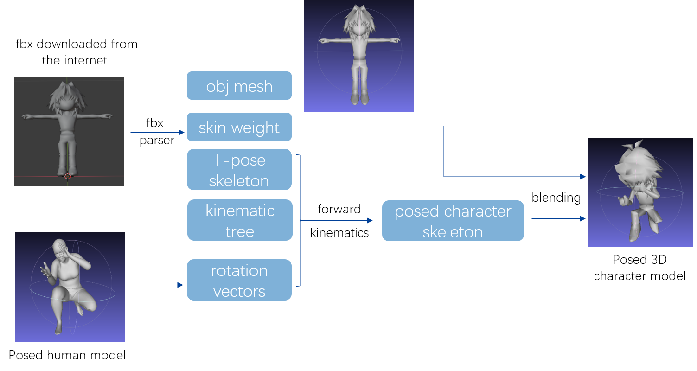

# Pose2Carton
A educational project (e.g., using 3D pose to control 3D carton) for learning 3D vision (application of human mesh recovery) or imitation learning

# Update Notes 
2021/05/20: Update the saving logic of mapping results(.pkl). **In previous version, pkl will not be overwritten, so if you try mapping multiple times, the pkl will stay as it was in previous mapping. This problem is fixed now, pls ensure that your `results/` is the latest version**

2021/05/17: Add quick start [instructions](doc/fbx_from_the_internet.md) to help you dive into this project & Use custom obj loader instead of open3d

# Requirements
* code only tested on linux system (ubuntu 16.04)
* open3d==0.11.0(**if you want to try online models, use open3d 0.10.0 along with your own video recording tool to save visualization**)
* tqdm
* opencv-python

`pip install -r requirements.txt` (anaconda recommended, python3)

# Tutorials
* For maya download & install: [Tutorial1](https://blog.csdn.net/otter1010/article/details/111396928), [Tutorial2](https://knowledge.autodesk.com/zh-hans/support/maya/learn-explore/caas/simplecontent/content/installing-maya-2020-ubuntu.html) [Tutoria3](https://blog.csdn.net/White_Idiot/article/details/78253004)
* For SMPL, refer to [webpage](https://smpl.is.tue.mpg.de/) or popular implementation [Minimal-IK](https://github.com/CalciferZh/Minimal-IK)
* For online model matching, refer to [OnlineMatchTutorial](doc/fbx_from_the_internet.md)

# Code structure
* [`transfer.py`](transfer.py): the main mapping file
* [`vis.py`](vis.py): visualize the mapping sequence of the corresponding mesh
* [`pose_samples`](pose_samples/): some samples of SMPL model for one frame
* [`obj_seq_id`](obj_seq_id/): some samples of SMPL model for temporal sequence

# Method

# Project Result

# Visulization
Run vis.py (to get more clear visualization, press ctrl + 1 / ctrl + 2 / ctrl + 3 ...)

# LICENSE
The code is under Apache-2.0 License.

# For EE228 students from SJTU
Please read course project [requirements](doc/EE228.md). 
