# Pose2Carton 

EE228 课程大作业 利用3D骨架控制3D卡通人物 (https://github.com/yuzhenbo/pose2carton) 

数据组别： 29

数据类型： 10组匹配 + 5组蒙皮


# Maya 环境配置

- 操作系统：Ubuntu

1. 解压maya安装包至任意位置，然后进入Packages
```
cd Packages/
```

2. 获取转换rpm软件包所需的软件包
```
sudo apt-get install alien dpkg-dev debhelper build-essential zlib1g-dev lsb-core libfam0 libcurl4 libpcre16-3 libjpeg62 libxm4 xfonts-100dpi xfonts-75dpi -y
```

3. 获取并安装libXp6和libpng15
```
sudo add-apt-repository ppa:zeehio/libxp 
sudo apt-get update 
sudo apt-get install libxp6
wget http://ftp.altlinux.org/pub/distributions/ALTLinux/Sisyphus/x86_64/RPMS.classic/libpng15-1.5.30-alt1.x86_64.rpm
sudo alien -vc libpng15-1.5.30-alt1.x86_64.rpm
sudo dpkg -i libpng15_1.5.30-1_amd64.deb
```

4. 将Packages/中的 rpm 软件包转换为 deb 软件包
```
sudo alien -vc *.rpm
```

5. 安装单机许可软件包
```
sudo apt install lsb-core
```

6. 安装许可软件包：adlmapps、adlmflexnetserveripv6、adlmflexnetclient 和 adsklicensing （这里注意，下面这些deb其实是上面出现的，需要再输入指令的时候自己确认是否一致）
```
sudo apt-get install ./adlmapps17_17.0.49-1_amd64.deb 
sudo apt-get install ./adlmflexnetserveripv6_17.0.50-1_amd64.deb 
sudo apt-get install ./adlmflexnetclient_17.0.49-1_amd64.deb
sudo apt-get install ./adsklicensing9.2.1.2399_0-1_amd64.deb
```

7. 确认许可服务正在运行
```
sudo systemctl status adsklicensing
```

8. 安装maya
```
sudo dpkg -i maya2020-64_2020.1-633_amd64.deb
```

9. 确认maya已注册
```
/opt/Autodesk/AdskLicensing/<版本号>/helper/AdskLicensingInstHelper list

# 否则用一下命令手动注册：
# sudo /opt/Autodesk/AdskLicensing/9.2.1.2399/helper/AdskLicensingInstHelper register -pk 657L1 -pv 2020.0.0.F -el EN_US -cf /var/opt/Autodesk/Adlm/Maya2020/MayaConfig.pit
```

10. 安装运行MAYA所需要的的其他软件包
```
sudo apt-get install libfam0 libcurl4 libpcre16-3 libjpeg62 libxm4 xfonts-100dpi xfonts-75dpi
#这一步是安装maya2020所需要的
sudo apt-get install --reinstall libxcb-xinerama0
sudo ln -s /usr/lib/x86_64-linux-gnu/libpcre16.so.3 /usr/autodesk/maya2020/lib/libpcre16.so.0
sudo ln -s /usr/lib/x86_64-linux-gnu/libssl.so.1.1 /usr/autodesk/maya2020/lib/libssl.so.10
sudo ln -s /usr/lib/x86_64-linux-gnu/libcrypto.so.1.1 /usr/autodesk/maya2020/lib/libcrypto.so.10
sudo ln -s /usr/lib/x86_64-linux-gnu/libXp.so.6 /usr/autodesk/maya2020/lib/libXp.so.6 
xset +fp /usr/share/fonts/X11/100dpi 
xset +fp /usr/share/fonts/X11/75dpi 
xset fp rehash
```

11. 需要 libpng15.so.15 来运行 Maya，由于 libpng15.so.15 不再作为软件包提供，因此需要从 Sourceforge 下载其源代码并在本地进行构建
```
cd /tmp 
wget https://sourceforge.net/projects/libpng/files/libpng15/older-releases/1.5.15/libpng-1.5.15.tar.gz
tar -zxvf ./libpng-1.5.15.tar.gz
cd libpng-1.5.15
./configure --prefix=/usr/local/libpng 
make  check
sudo make install make check
sudo ln -s /usr/local/libpng/lib/libpng15.so.15 /usr/autodesk/maya2020/lib/libpng15.so.15
```

12. 创建/usr/tmp
```
sudo mkdir /usr/tmpa 
sudo chmod 777 /usr/tmp
```

13. Maya.env 文件位于 ~/maya/2020/Maya.env 中，如果该文件不存在，您可以创建。您将需要设置 MAYA_DISABLE_CIP 和 LC_ALL。MAYA_DISABLE_CIP 可禁用 ADP，这可能会导致关闭时挂起，而 LC_ALL 可确保 Maya 与 Ubuntu 颜色校正结合使用。
 ```
 echo "MAYA_DISABLE_CIP=1" >> ~/maya/2020/Maya.env 
echo "LC_ALL=C" >> ~/maya/2020/Maya.env
```

14. 在~.bashrc中设置环境变量
```
echo "alias mayapy = '/usr/autodesk/maya/bin/mayapy' " >> ~/.bashrc
```

# 匹配流程

## 仅匹配流程：

- 把`transfer.py`的main中其他行都注释掉，只保留最后一行的`transfer_one_sequence`，用包含待匹配模型rig信息的txt路径替换原本路径，并将`use_online_model`设为False。
- 运行`python transfer.py`，此时代码会中断并输出待匹配模型的关节点信息，确认其中信息无误并将关节点的对应关系填入`manual_model_to_smpl`。注意到这里关节点名称顺序可能会对不上，可以用maya打开对应模型文件肉眼判断。
- 再次运行`python transfer.py`即可。
- 运行`python vis.py`查看可视化结果并保存。

## 蒙皮（网上的fbx模型）流程：
- 运行`mayapy fbx_parser.py {/path/to/fbx/}`。运行成功会生成三种文件：包含了rig信息的txt文件、包含了T-Posed的mesh的obj文件和包含了蒙皮所需texture信息的fbm文件。
- 运行`transfer.py`进行蒙皮+匹配操作，与仅匹配流程类似，但是要把`use_online_model`设为True。
- 把`vis.py`中的`use_online_model`设为True，然后运行`python vis.py`查看可视化结果并保存。

## 部分代码解释
### fbx_parser.py

此代码主要负责解析从网上下载的fbx模型，提取出后续蒙皮和姿态迁移等任务所需的信息和文件。

首先根据命令行内输入的fbx文件路径参数导入对应的fbx文件，然后使用\_getHierarchyRootJoint函数寻找该模型对应的最顶层的父节点（根节点）。接着分别使用getJointDict函数和getGeometryGroups函数获取模型内所有节点的对应关系字典，以及模型节点之间的几何信息。然后把获取到的rig信息保存成txt格式。

最后，利用上述得到的数据导出后续蒙皮和匹配操作所需的文件和数据。其中，record\_info函数负责整合和导出txt格式的rig信息，而record\_obj负责将纹理贴图、obj、mtl保存成相对应的文件。

### transfer.py

- 此代码主要利用transfer\_one\_sequence函数将模型匹配到一个序列上，详细过程如下：

输入为所匹配模型的riginfo文件（txt格式）和目标动作序列（pkl文件）。若使用网络模型，分析riginfo文件使用\_get\_extra\_uv\_lines函数从riginfo文件中解析包含 uv 坐标和详细人脸信息的uv\_lines，之后遍历保存texture或material。
对pkl每一帧对应姿态进行如下操作：
利用函数transfer\_given\_pose获得输出的info和mesh，遍历写入输出mesh的顶点，若使用网络模型，再写入之前获取的蒙皮信息。

- 函数transfer\_given\_pose操作：

人体转移的核心功能，给定人体姿势（24 × 3，旋转向量），角色 riginfo（.txt），角色 T 姿势网格（.obj），执行转移。
1.解析rig info文件，获取关节名称到关节索引的映射，根据层次信息构建结构运动链。
2.从rig info文件解析蒙皮权重和T-posed骨架。
3.构建映射，如果匹配到的关节小于10个则会停止并警告。
4.沿运动链计算正向运动过程，从T-pose 获取关节偏移值，进行线性混合蒙皮即使用正向运动学将T型骨架转化为姿势角色骨架。
5.最后使用混合权重获得姿势网格，保存文件。

- 其他工具函数：

\_lazy\_get\_model\_to\_smpl：直接根据名称匹配给出模型与SMPL模型的关节。

\_get\_extra\_uv\_lines：从riginfo文件中解析包含 uv 坐标和详细人脸信息的uv\_lines。

rodrigues：将旋转向量转换为旋转矩阵。

### vis.py

此代码利用transfer.py所获得的结果生成可视化的图片以及vis.mp4。

工具函数：

set\_color：对vertice的颜色进行归一化处理并设置mesh的顶点颜色。

compose\_video：利用cv2.VideoWriter保存24帧的vis视频。

首先设置保存路径等参数，获得一visualizer实例。根据basename第一字符分别对human和obj文件进行排序。
对model的obj序列逐一进行如下操作：

从此帧文件中读取mesh，设置人的mesh的顶点的三维位置，之后进行平移。若不为网络模型，利用set\_color使mesh有颜色属性（网络模型有蒙皮）在可视化工具中添加mesh，最后保存png文件。

最后利用compose\_video生成vis.mp4视频。

# 新增脚本说明

xxx (如果你写了自己的脚本来处理数据或进行可视化，请在这里进行相关说明(如何使用等)； 如果没有，请忽略该模块。)


# 项目结果

最终匹配结果的截图如下。

## 10个匹配结果：
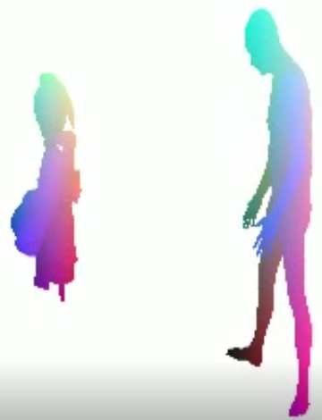
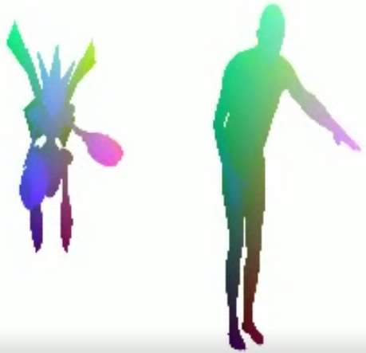
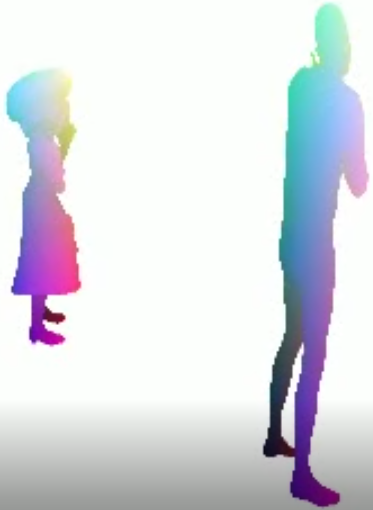
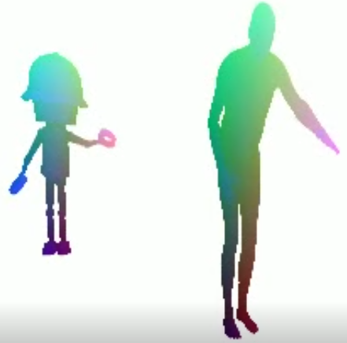
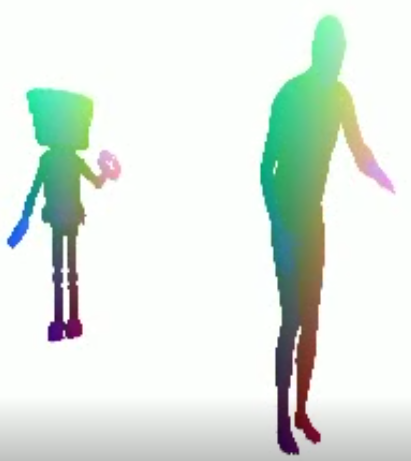
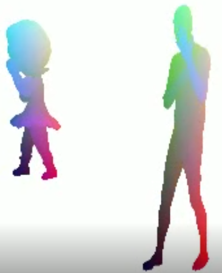
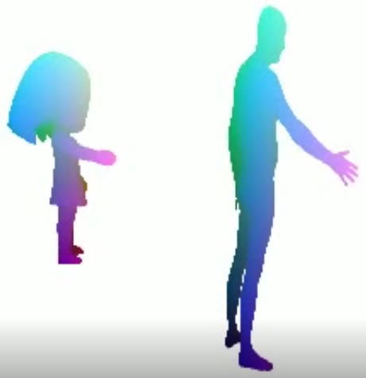
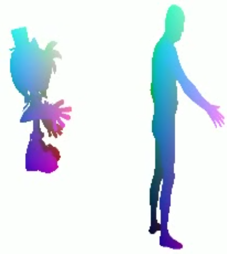
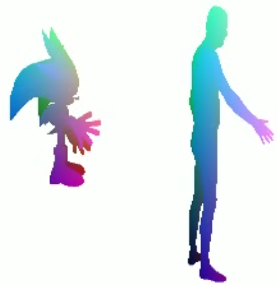
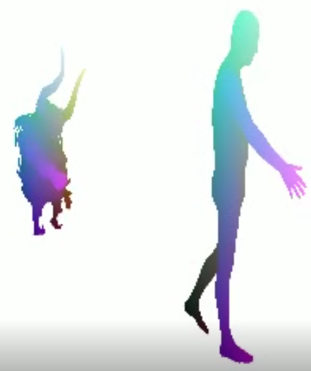

## 5个蒙皮结果：
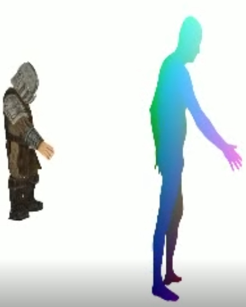
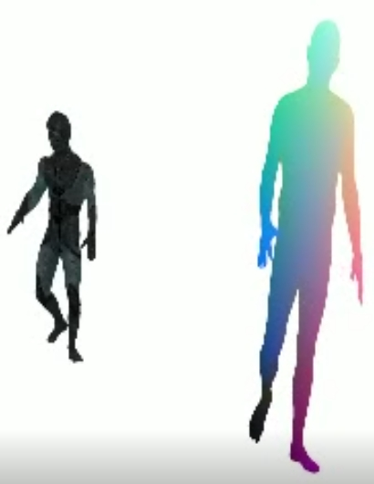
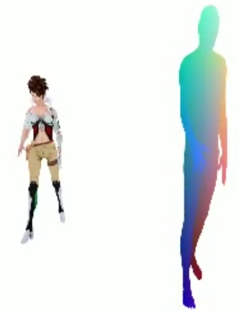
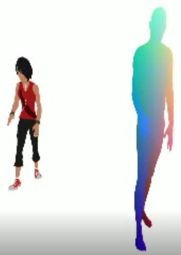
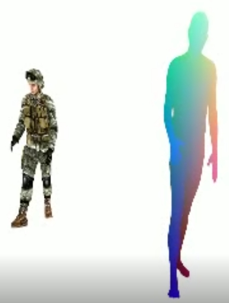


# 协议 
本项目在 Apache-2.0 协议下开源

所涉及代码及数据的所有权以及最终解释权归倪冰冰老师课题组所有. 
